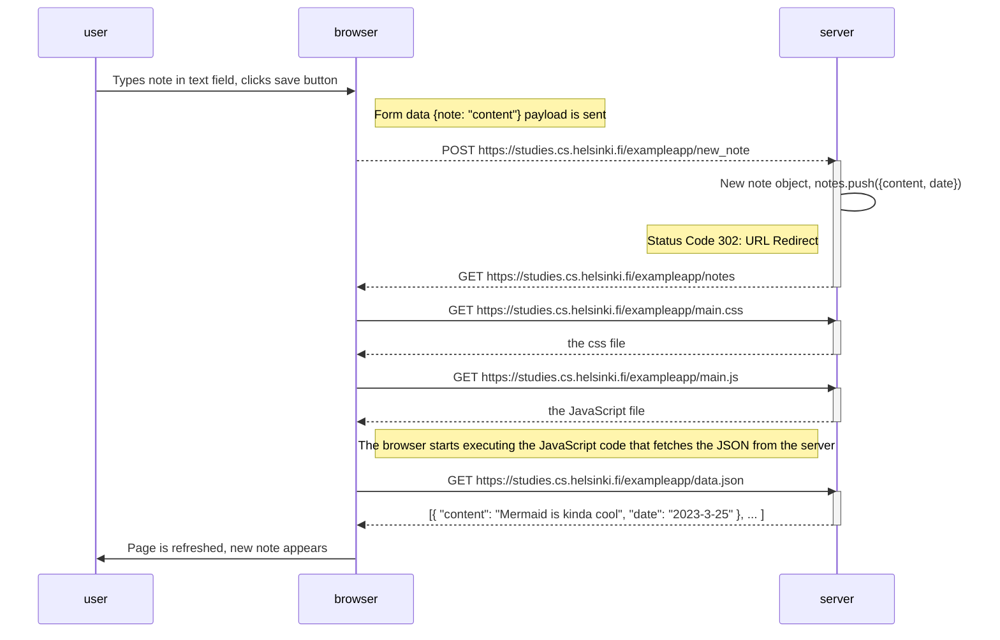

```mermaid
sequenceDiagram
    participant user
    participant browser
    participant server

    user->>browser: Types note in text field, clicks save button

    note right of browser: Form data {note: "content"} payload is sent

    browser-->>server: POST https://studies.cs.helsinki.fi/exampleapp/new_note
    activate server

    server->server: New note object, notes.push({content, date})

    note left of server: Status Code 302: URL Redirect

    server-->>browser: GET https://studies.cs.helsinki.fi/exampleapp/notes
    deactivate server

    browser->>server: GET https://studies.cs.helsinki.fi/exampleapp/main.css
    activate server
    server-->>browser: the css file
    deactivate server

    browser->>server: GET https://studies.cs.helsinki.fi/exampleapp/main.js
    activate server
    server-->>browser: the JavaScript file
    deactivate server

    Note right of browser: The browser starts executing the JavaScript code that fetches the JSON from the server

    browser->>server: GET https://studies.cs.helsinki.fi/exampleapp/data.json
    activate server
    server-->>browser: [{ "content": "Mermaid is kinda cool", "date": "2023-3-25" }, ... ]
    deactivate server

    browser->>user: Page is refreshed, new note appears
```
