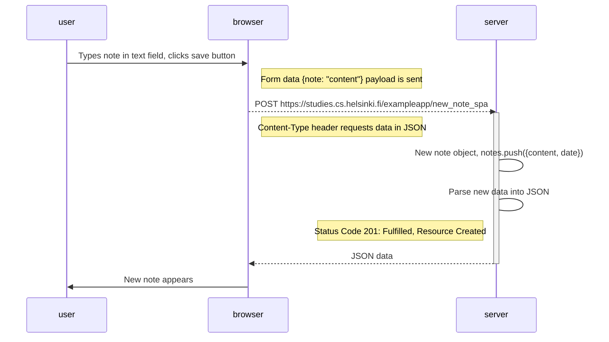

```mermaid
sequenceDiagram
participant user
participant browser
participant server

    user->>browser: Types note in text field, clicks save button

    note right of browser: Form data {note: "content"} payload is sent

    browser-->>server: POST https://studies.cs.helsinki.fi/exampleapp/new_note_spa
    activate server

    note right of browser: Content-Type header requests data in JSON

    server->server: New note object, notes.push({content, date})
    server->server: Parse new data into JSON

    note left of server: Status Code 201: Fulfilled, Resource Created

    server-->>browser: JSON data
    deactivate server

    browser->>user: New note appears
```
